# FreezeD: a Simple Baseline for Fine-tuning GANs

**Update (2020/10/28)**

Release [checkpoints](https://drive.google.com/drive/folders/140y2e80koKA_URy6cNChpK4LKqGjWnv0) of StyleGAN fine-tuned on cat and dog datasets.

**Update (2020/04/06)**

Current code evaluates FID scores with `inception.train()` mode. Fixing it to `inception.eval()` may degrade the overall scores (both competitors and ours; hence the trend does not change). Thanks to @jychoi118 ([Issue #3](https://github.com/sangwoomo/FreezeD/issues/3)) for reporting this.

---

Official code for ["**Freeze the Discriminator: a Simple Baseline for Fine-Tuning GANs**"](https://arxiv.org/abs/2002.10964) (CVPRW 2020).

The code is heavily based on the [StyleGAN-pytorch](https://github.com/rosinality/style-based-gan-pytorch) and [SNGAN-projection-chainer](https://github.com/pfnet-research/sngan_projection) codes.

See `stylegan` and `projection` directory for StyleGAN and SNGAN-projection experiments, respectively.

**Note:** There is a bug in PyTorch 1.4.0, hence one should use `torch>=1.5.0` or `torch<=1.3.0`. See Issue [#1](https://github.com/sangwoomo/FreezeD/issues/1).

## Generated samples

Generated samples over fine-tuning FFHQ-pretrained StyleGAN

 &nbsp; 


### More generated samples (StyleGAN)

Generated samples under [Animal Face](https://vcla.stat.ucla.edu/people/zhangzhang-si/HiT/exp5.html) and [Anime Face](http://www.nurs.or.jp/~nagadomi/animeface-character-dataset/) datasets

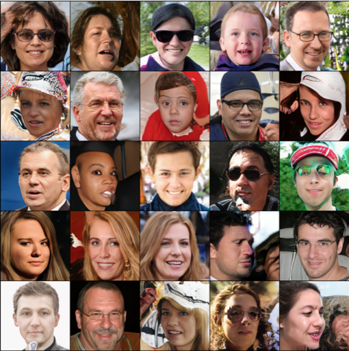 &nbsp; 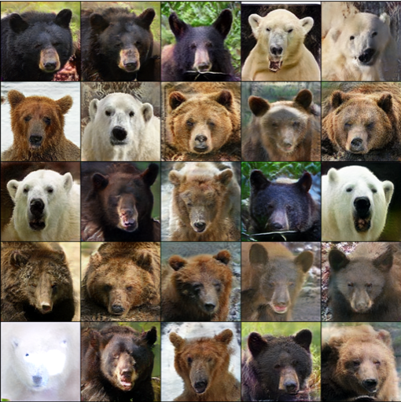 &nbsp; 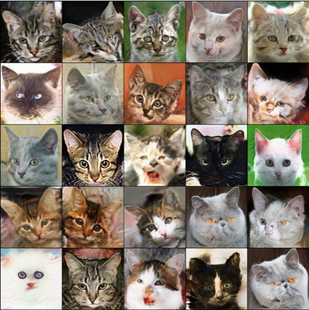

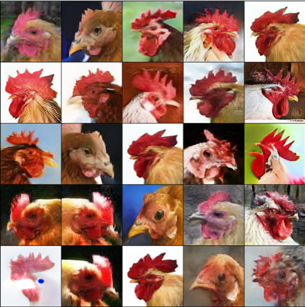 &nbsp; 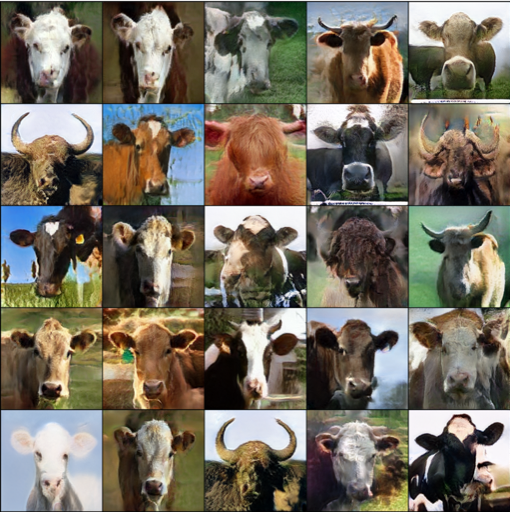 &nbsp; 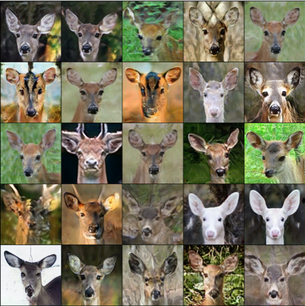

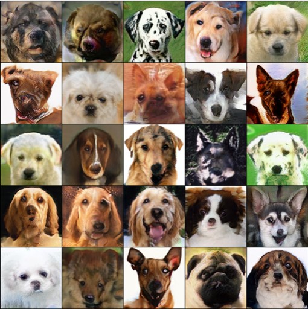 &nbsp; 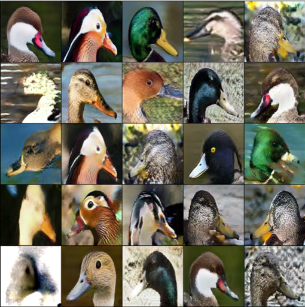 &nbsp; 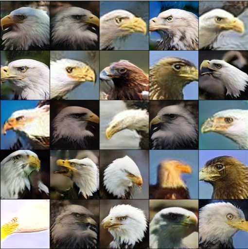

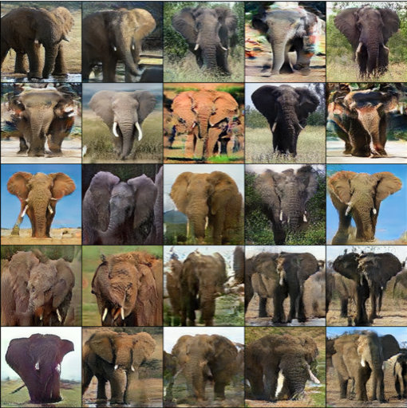 &nbsp; 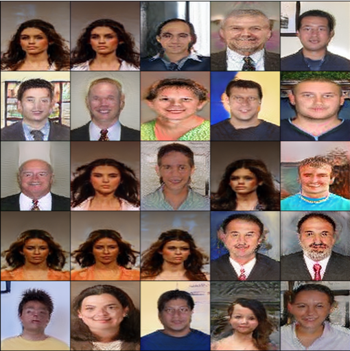 &nbsp; 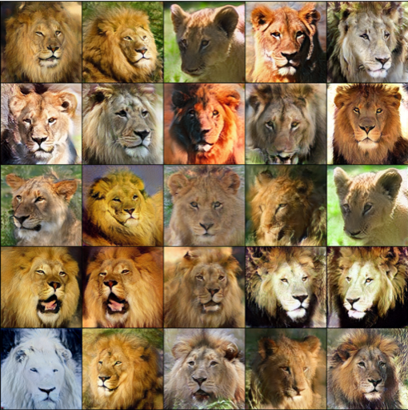

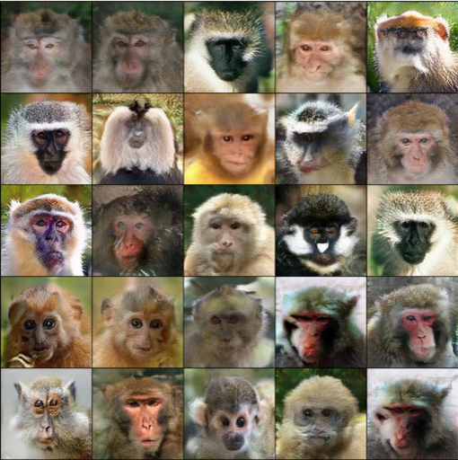 &nbsp; 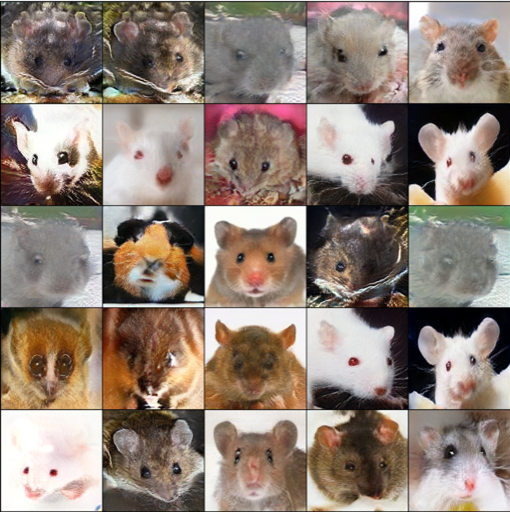 &nbsp; 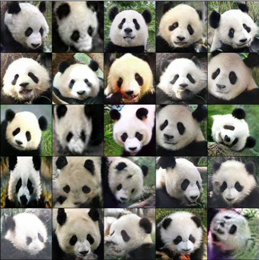

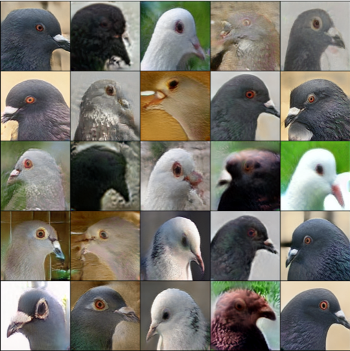 &nbsp; 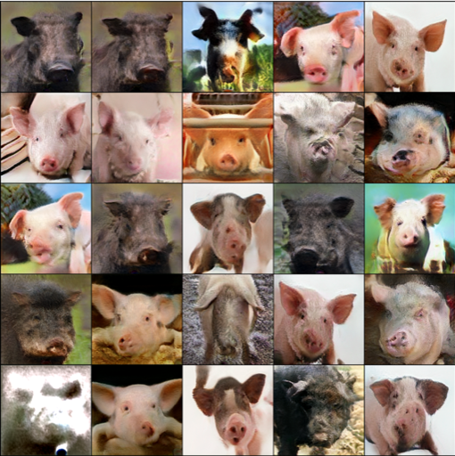 &nbsp; 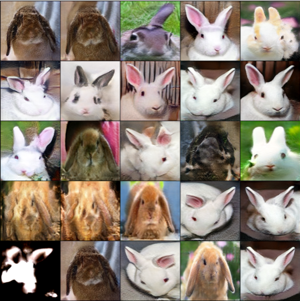

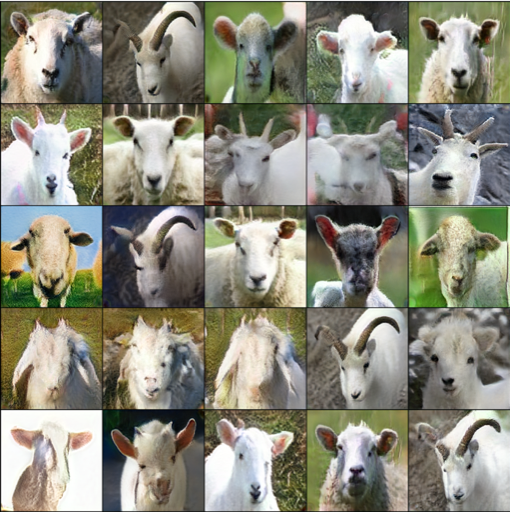 &nbsp; 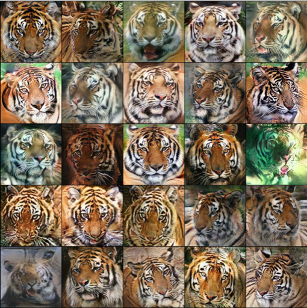 &nbsp; 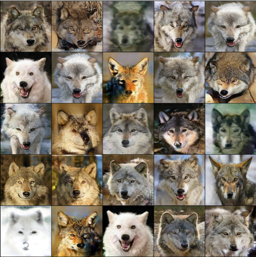

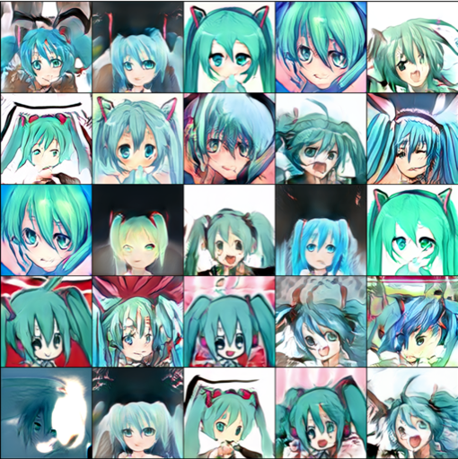 &nbsp; 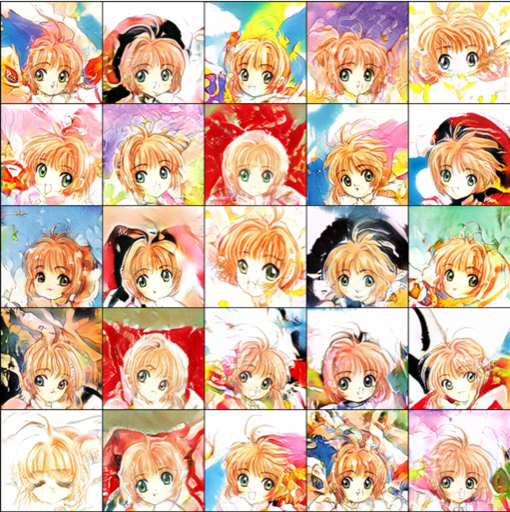 &nbsp; 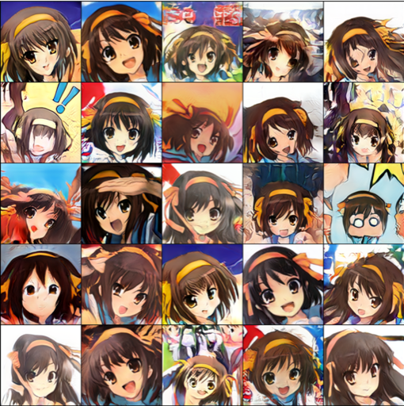

 &nbsp; 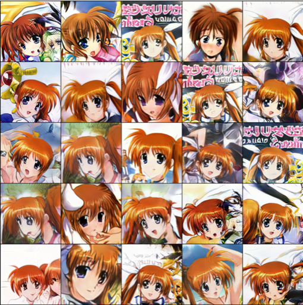 &nbsp; 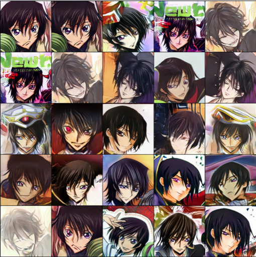

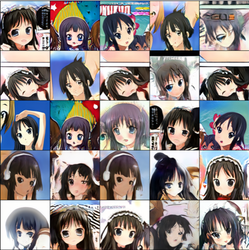 &nbsp; 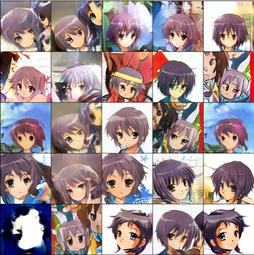 &nbsp; 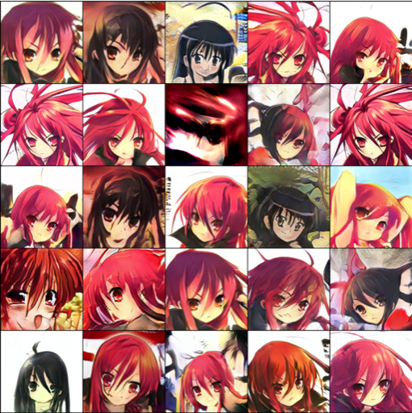


### More generated samples (SNGAN-projection)

Comparison of fine-tuning (left) and freeze D (right) under [Oxford Flower](https://www.robots.ox.ac.uk/~vgg/data/flowers/102/index.html), [CUB-200-2011](http://www.vision.caltech.edu/visipedia/CUB-200-2011.html), and [Caltech-256](http://www.vision.caltech.edu/Image_Datasets/Caltech256/) datasets

Freeze D generates more class-consistent results (see row 2, 8 of Oxford Flower)

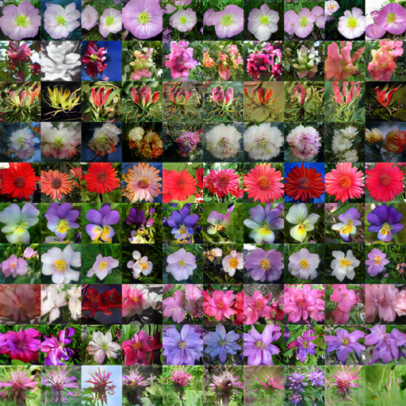 &nbsp; 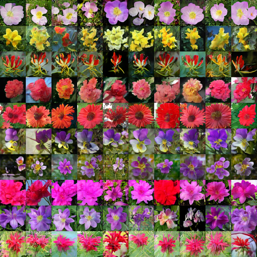

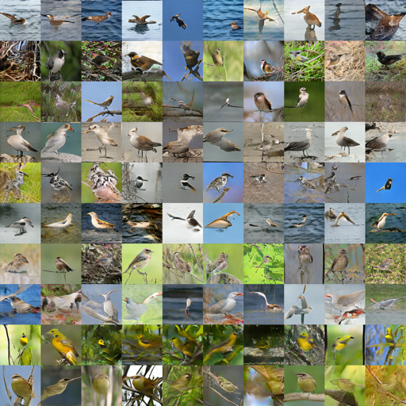 &nbsp; 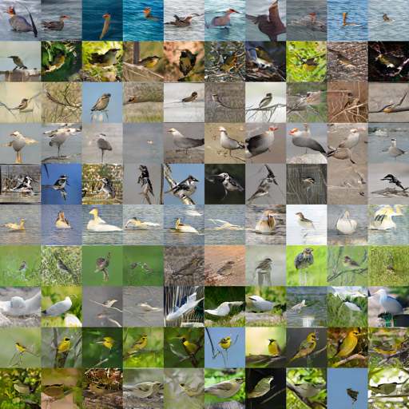

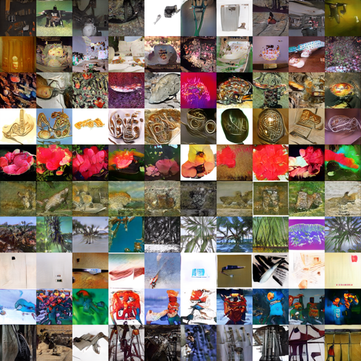 &nbsp; 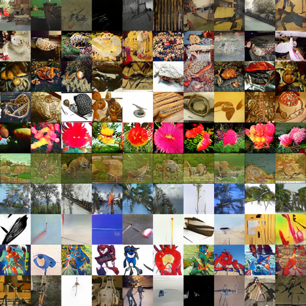


## Citation
If you use this code for your research, please cite our papers.
```
@inproceedings{
    mo2020freeze,
    title={Freeze the Discriminator: a Simple Baseline for Fine-Tuning GANs},
    author={Mo, Sangwoo and Cho, Minsu and Shin, Jinwoo},
    booktitle = {CVPR AI for Content Creation Workshop},
    year={2020},
}
```
